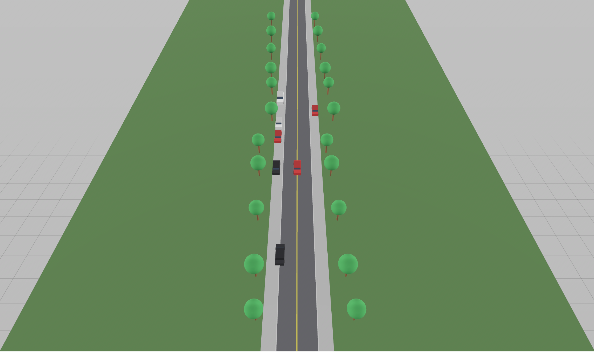

# Dashcam → Digital Twin

Turn a real dashcam clip into an OpenUSD scenario an Omniverse-compatible simulator can consume — in one command, ~600 lines of Python.

Built with [NVIDIA Cosmos-family reasoning VLMs](https://build.nvidia.com/nvidia/cosmos3-nano-reasoner) (via the hosted API on build.nvidia.com) and [OpenUSD](https://openusd.org/). Runs from a laptop; no GPU required on the client.



*Above: the USD stage generated from a ~13-second real dashcam clip of a sunny residential street. Every element — road geometry, actors, positions, sun angle — is derived from a single hosted-API call to the VLM. Committed sample lives under [`examples/dashcam_residential/`](examples/dashcam_residential/).*

> 📄 **Read the [case study](docs/CASE_STUDY.md)** — why this pipeline exists, who it enables, and what a first-week partner onboarding looks like.

## The 30-second pitch

Fleet operators and OEM safety teams sit on terabytes of dashcam footage they can't turn into simulation scenarios. This pipeline uses a Cosmos-family VLM to extract a structured scene understanding from a real clip, then emits a USD stage that opens in Omniverse — turning a passive recording into a reproducible test scenario in one command. The output is a small, diff-able JSON scene contract plus a human-readable `.usda` file: no black box, no bespoke integration.

## Pipeline

```
dashcam.mp4  ─►  [ NVIDIA hosted VLM ]  ─►  scene.json  ─►  [ USD builder ]  ─►  scene.usda
                 (schema-constrained)      (contract)      (deterministic)      (Omniverse-ready)
```

## Quickstart

```bash
python3 -m venv venv && source venv/bin/activate
pip install -r requirements.txt
cp .env.example .env       # paste your NVIDIA API key from build.nvidia.com
python build_twin.py your_clip.MOV
open twins/your_clip/scene.usda
```

Output lands in `twins/<clip_stem>/`:

- `scene.json` — schema-validated structured extraction
- `scene.usda` — OpenUSD stage (opens in Omniverse USD Composer, Reality Composer Pro, Blender, or `usdview`)
- `README.md` — auto-generated per-run summary

## Sample output

The committed sample under [`examples/dashcam_residential/`](examples/dashcam_residential/) runs the pipeline on a real dashcam clip of a sunny residential street. Clone the repo and open `examples/dashcam_residential/scene.usda` in any USD viewer — no API key required to view.

**What the model extracted from the clip:** residential 2-lane street, clear day, moderate ego speed, 7 actors (parked white van, red parked car, white parked car, red parked car, oncoming black car at medium distance, parked black car, cyclist far ahead), trees + buildings on both sides.

**What the USD stage renders:** ego red composite car at the origin, rows of composite cars flanking both sides on parking positions, one composite car offset to the left and rotated 180° (oncoming), a cyclist far down the road (torso + head + bike frame + wheels), asphalt road with double yellow center line, gray curbs, sidewalks, green lawn strips, 28 deterministically-jittered trees, and a warm directional sun matching the extracted azimuth.

## Fleet search (bonus)

Once you've generated a few twins, you can semantically search across them with NVIDIA's NeMo Retriever:

```bash
python build_twin.py clip_a.mp4
python build_twin.py clip_b.mp4
python fleet_search.py index                              # embed all twins/*/scene.json
python fleet_search.py query "oncoming vehicles in rain"  # cosine-sim search
```

Uses `nvidia/nemotron-3-embed-1b` (2048-dim vectors) via the hosted API, plus a tiny numpy cosine-similarity backend — no vector DB dependency. See [`fleet_search.py`](fleet_search.py).

The demo in this repo ships with N=1 because there's only one dashcam clip committed. The point is the shape of the pipeline; at N=1000 it's the beginning of a queryable fleet.

## Files

| File | Purpose |
|------|---------|
| [`build_twin.py`](build_twin.py) | CLI orchestrator. `python build_twin.py <clip> [-o out/] [--dry-run]` |
| [`scene_extractor.py`](scene_extractor.py) | Stage 1. Prompts the VLM for schema-constrained JSON, validates with Pydantic. |
| [`usd_builder.py`](usd_builder.py) | Stage 2. Maps qualitative positions to USD prims (ego, actors, ground, lane stripes, sidewalks, trees, sky). |
| [`fleet_search.py`](fleet_search.py) | Extension. Embed many extracted scenes with NeMo Retriever; natural-language search. |
| [`nvidia_client.py`](nvidia_client.py) | Shared: base64-encoding, API auth, model + embed-model constants. |
| [`analyze.py`](analyze.py) | Simple companion: video → freeform prose description (the first thing built while exploring the API). |
| [`docs/CASE_STUDY.md`](docs/CASE_STUDY.md) | Written case study — the problem, the enablement recipe, the metrics. |
| [`docs/demo_shot_list.md`](docs/demo_shot_list.md) | Shot list for the ~60-second screen recording that becomes `docs/demo.gif`. |

## Model choice — a small saga

The prototype uses `nvidia/nemotron-3-nano-omni-30b-a3b-reasoning` via `https://integrate.api.nvidia.com/v1` (OpenAI-compatible).

The originally-targeted `nvidia/cosmos3-nano-reasoner` is a **NIM-container release** — needs Linux + NVIDIA GPU, so not runnable on a Mac client. `nvidia/cosmos-reason2-8b` is listed in the hosted `/v1/models` catalog but its NVCF function is **not entitled** to a fresh build.nvidia.com account — a subtle gotcha (the `/v1/models` listing is misleading; use `GET /v2/nvcf/functions` to see what your account can actually invoke). Nemotron-Omni is entitled by default, handles video, and is the pragmatic choice for a hosted-API demo. Everything the pipeline does is model-agnostic: swap `MODEL` in `nvidia_client.py` when Cosmos3 becomes hosted or you're running your own NIM.

## Limits (deliberate)

- **Videos are inlined as base64 in one request.** Hard cap at 25 MB. Longer clips need the NVCF Asset upload flow (not yet implemented).
- **Qualitative positions, not metric.** Monocular VLMs can't estimate real-world distance reliably; the schema uses `close / medium / far` on purpose.
- **Single keyframe, not animated.** Actors don't move over time. Frame-by-frame extraction + monocular tracking is a big lift for marginal demo value.
- **Placeholder geometry, not photoreal.** Vehicles are composite primitives (chassis + cabin + windshield + wheels). Swap in a partner's real USD asset library on day one of integration.

## Roadmap

- **Cosmos Predict variations** — regenerate the same scene at night / in rain / with an added pedestrian for corner-case augmentation.
- **NVCF Asset upload** for videos >25 MB.
- **Frame-by-frame extraction** with a lightweight tracking pass for actor animation.
- **NeMo Guardrails** on top of `fleet_search.py` for output safety (redact PII from prose, restrict scene-topic queries).
- **Reference USD vehicle assets** so partners can preview with production geometry without wiring in their own library first.

## License

MIT — see [LICENSE](LICENSE).
